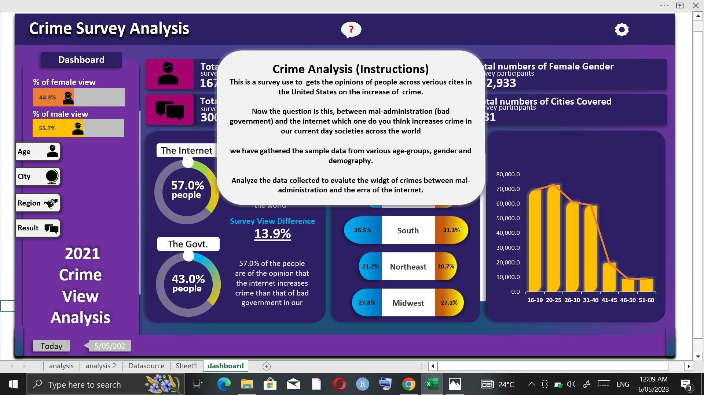
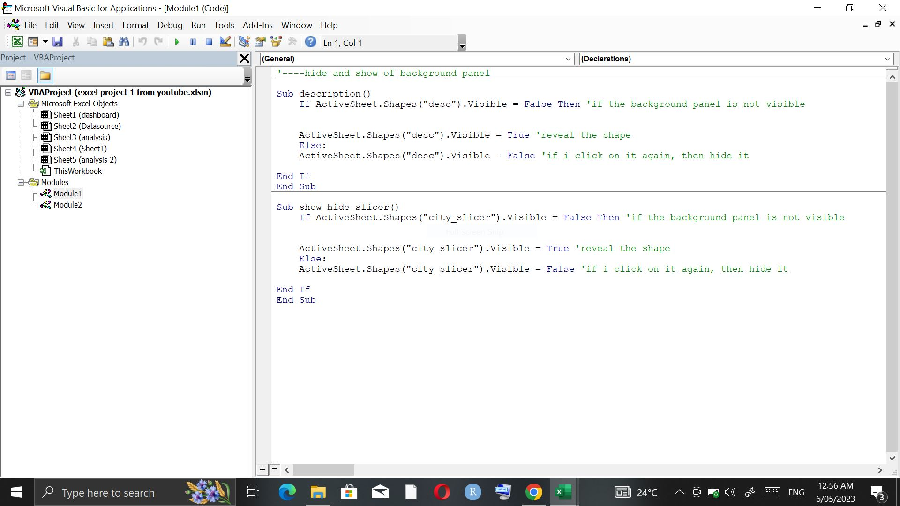
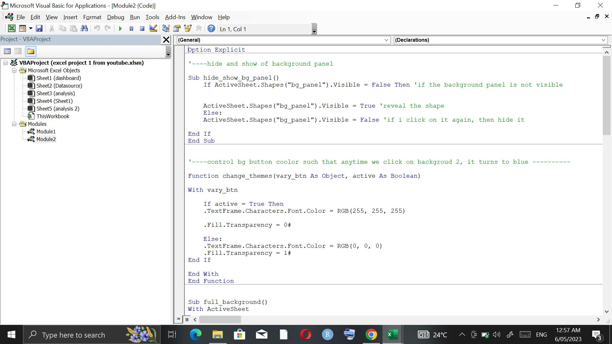
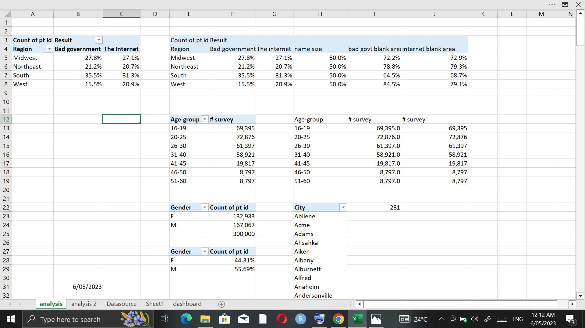
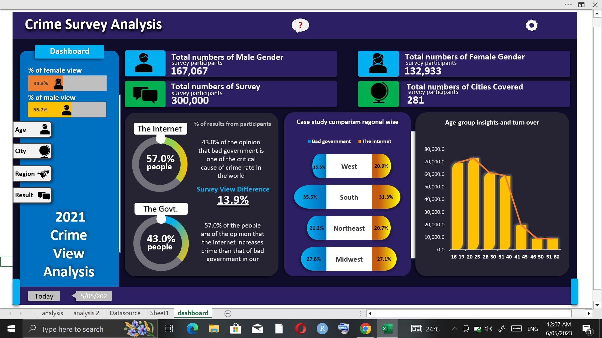

# Crime-Survey-Analysis

---

## Business Case
This is a survey use to  gets the opinions of people across verious cites in the United States on the increase of  crime.
Now the question is this, between mal-administration (bad government) and the internet which one do you think increases crime in our current day societies across the world

**_This is an Excel project done with excel pivot tables, macros and vba_**

## Skills/Concept demonsstrated

The following Excel dashboard features were incoporated:

- Data cleaning
- Vba and Macros

| vba1| vba2 |
| --- | --- |
|    |  |

- Slicers
- Pivot tables and charts
  

- Formulas and functions
- Data visualization
  
